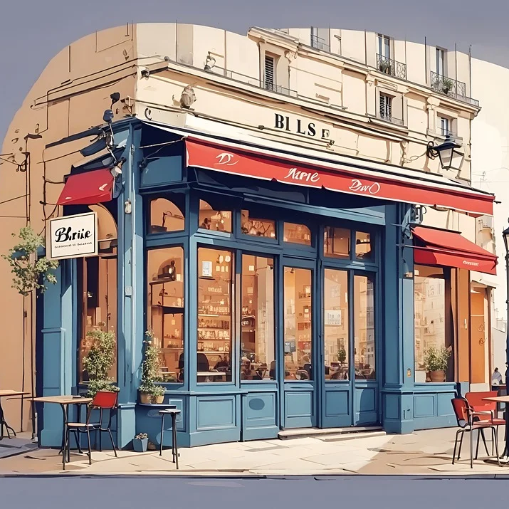
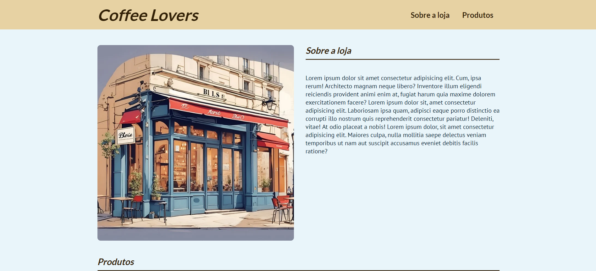
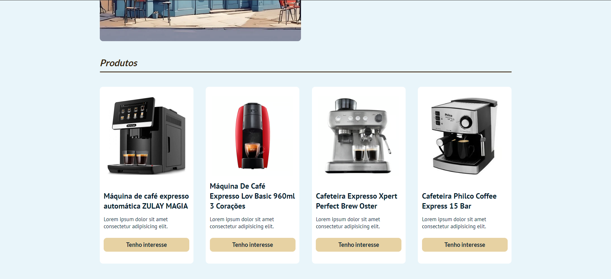
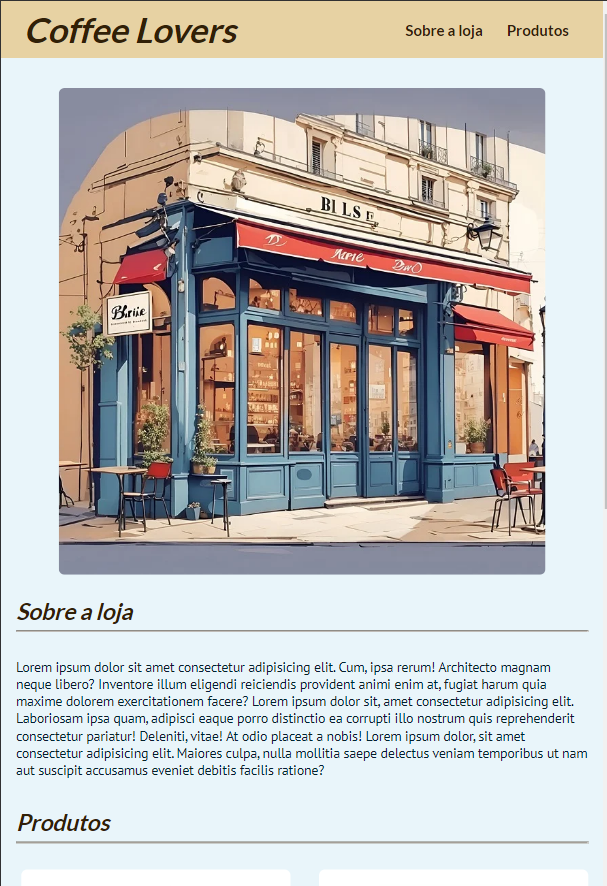
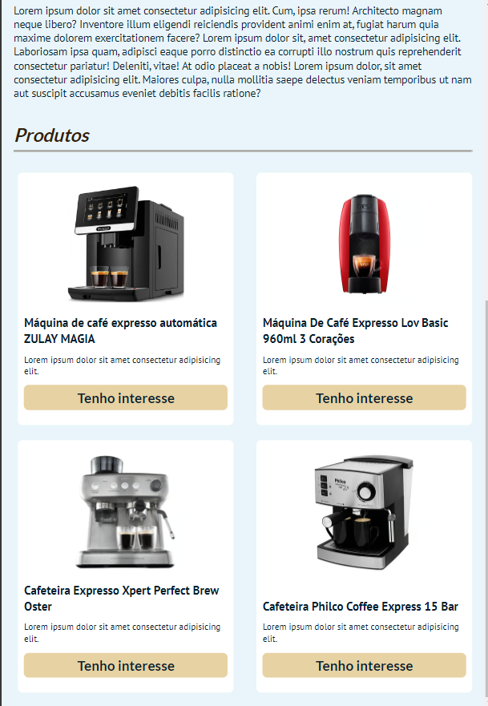
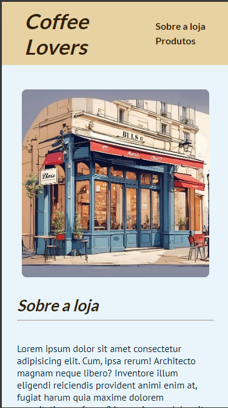
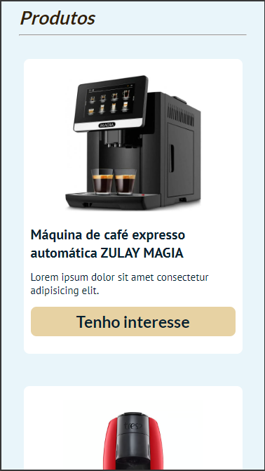
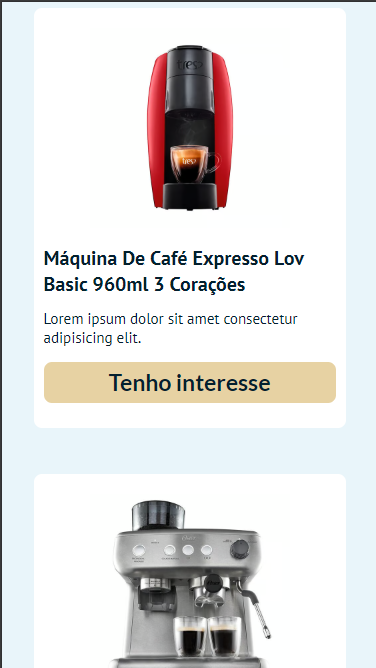

# Coffee Lovers Online Shop - CSS Responsivity


This application is a study of media queries and responsive layouts for different screen sizes. 

## Index
- <a href="#functionalities">Application functionalities</a>
- <a href="#layout">Layout</a>
- <a href="#demonstration">Demonstration</a>
- <a href="#run">How to run the application</a>
- <a href="#tecnologies-used">Tecnologies used</a>
- <a href="#developer">Developer</a>

## Application functionalities
 - [x]  Responsive layout

## Layout
1. Desktop
<br/>
<br/>

<br/>
<br/>

<br/>
<br/>
2. Tablet
<br/>
<br/>

<br/>
<br/>

3. Phone
<br/>
<br/>

<br/>
<br/>

<br/>
<br/>


## Demonstration
[Link (deploy)](This application is a study of media queries and responsive layouts for different screen sizes. )


## How to run the application
```bash
# Clone this repository
$ git clone repolink

# Acess the app folder on your terminal
$ cd coffee-lovers-online-shop-media-queries

# Utilize a local server launch tool to view the application in your browser
```

## Tecnologies used
1. HTML
2. CSS

## Developer
[LinkedIn](https://www.linkedin.com/in/julia-silva-borges/)
